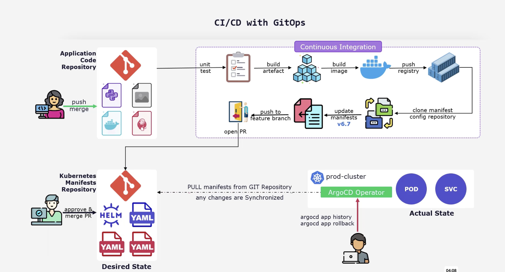
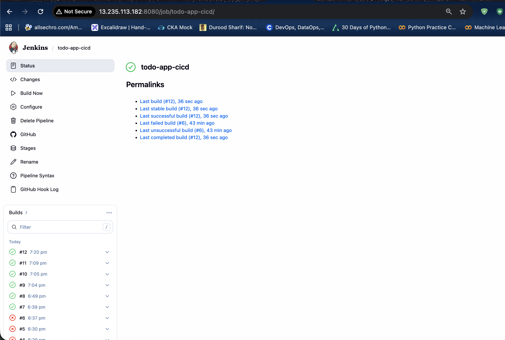

# Jenkins + GitOps + Kubernetes CI/CD Project

This project showcases a practical CI/CD and GitOps workflow built around a containerized Node.js application. It demonstrates how source code moves from a GitHub push to a Docker image build in Jenkins, then into a Kubernetes deployment managed through Argo CD.

## Project Flow

The diagram below summarizes the delivery flow used in this project, from application code changes to GitOps-based deployment in Kubernetes.



From a recruiter’s point of view, this project highlights hands-on experience with:

- Jenkins pipeline creation and troubleshooting
- Docker image build and registry publishing
- GitOps deployment flow using a separate manifests repository
- Kubernetes `Deployment` and `Service` resources
- Argo CD application creation and sync management
- secret handling outside Git for safer deployment practices

## Project Repositories

This setup uses two separate GitHub repositories.

- Application repository:
  `https://github.com/imhashmi8/jenkins-gitops-kubernetes-app`

- Deployment repository:
  `https://github.com/imhashmi8/jenkins-gitops-kubernetes-deployment`

The separation is intentional and follows a GitOps-friendly pattern:

- the app repository contains source code, Dockerfile, and Jenkins pipeline
- the deployment repository contains Kubernetes manifests
- Argo CD watches only the deployment repository

## High-Level Workflow

```text
Developer pushes code to application repo
        |
        v
Jenkins pipeline starts
        |
        |-- checkout source code
        |-- build Docker image
        |-- push image to Docker Hub
        |-- clone deployment repo
        |-- update image tag in deployment manifest
        |-- commit and push manifest changes
        v
Argo CD detects updated manifest in deployment repo
        |
        v
Kubernetes cluster syncs and deploys new image
```

## Current Setup

### 1. Application Layer

The application is a Node.js and Express-based Todo app backed by MongoDB Atlas.

Current app characteristics:

- containerized with Docker
- runs on port `3000`
- uses `MONGO_URI` from environment variables
- built and tagged by Jenkins

### 2. Jenkins CI Pipeline

Jenkins is configured to:

- trigger on GitHub push
- read the `Jenkinsfile` from the application repository
- build the Docker image
- push the image to Docker Hub
- clone the deployment repository
- update the Kubernetes deployment manifest with the new image tag
- commit and push the updated manifest back to GitHub

This keeps CI in Jenkins while leaving cluster reconciliation to Argo CD.

## Jenkins Configuration

If you want to reproduce this setup from scratch, configure Jenkins with the same assumptions used in the [`Jenkinsfile`](/Users/mdqamarhashmi/Documents/Qamar-Files/Projects/jenkins-gitops-kubernetes-app/Jenkinsfile).

### Jenkins Prerequisites

Before creating the pipeline job, make sure Jenkins has:

- Git installed on the Jenkins host
- Docker installed and accessible to the Jenkins user
- outbound access to GitHub and Docker Hub
- the recommended plugins for:
  Git
  GitHub Integration
  Pipeline
  Docker Pipeline
  Credentials Binding

### Jenkins Credentials

Create these credentials in Jenkins before running the pipeline:

- `docker-hub`
  Type: `Username with password`
  Purpose: authenticate Jenkins to Docker Hub for image pushes

- `github-token`
  Type: `Secret text`
  Purpose: allow Jenkins to push manifest updates to the deployment repository

These names should match the credential IDs referenced in the pipeline:

- `docker-hub`
- `github-token`

### Create the Jenkins Pipeline Job

1. Open Jenkins and click `New Item`.
2. Enter a job name such as `todo-app-cicd`.
3. Choose `Pipeline` and create the job.
4. In the job configuration, enable `GitHub project` if you want the repository URL visible in Jenkins.
5. Under `Build Triggers`, enable `GitHub hook trigger for GITScm polling`.
6. Under `Pipeline`, choose `Pipeline script from SCM`.
7. Select `Git` as the SCM.
8. Set the repository URL to the application repository:
   `https://github.com/imhashmi8/jenkins-gitops-kubernetes-app.git`
9. Select the branch to build, for example `*/main`.
10. Keep the script path as `Jenkinsfile`.
11. Save the job and run `Build Now` once to validate the setup.

### GitHub Webhook Setup

To trigger the pipeline automatically on every push:

1. Open the application repository in GitHub.
2. Go to `Settings` > `Webhooks`.
3. Add a webhook that points to:
   `http://<your-jenkins-server>/github-webhook/`
4. Set the content type to `application/json`.
5. Choose `Just the push event`.
6. Save the webhook and push a test commit.

### Pipeline Behavior in This Project

This Jenkins pipeline currently expects:

- the Docker image repository owner to be `hashmi111`
- the application image name to be `todo-app`
- the deployment repository name to be `jenkins-gitops-kubernetes-deployment`
- the Kubernetes manifest path inside that repo to be `todo-app-k8s-manifest/deployment.yaml`

During execution Jenkins:

1. builds a Docker image tagged with `${BUILD_ID}-${GIT_COMMIT}`
2. pushes the image to Docker Hub
3. clones or pulls the deployment repository
4. updates the image tag inside `deployment.yaml`
5. commits and pushes the manifest change back to GitHub

### Optional Jenkins Global Configuration Checks

If the pipeline does not work on the first run, verify these Jenkins settings:

- Docker commands can run without permission issues for the Jenkins user
- the Jenkins instance URL is set correctly under system configuration
- GitHub webhook requests can reach port `8080` on the Jenkins server
- the `main` branch exists in both repositories
- the deployment repository allows push access with the configured GitHub token

### 3. Deployment Repository

The deployment repository stores the Kubernetes manifests used by Argo CD, including:

- `deployment.yaml`
- `service.yaml`

This repository acts as the source of truth for the deployed state.

### 4. Argo CD Continuous Delivery

Argo CD is configured to monitor the deployment repository. Once Jenkins updates the image tag and pushes the manifest change, Argo CD detects the drift and syncs the application to Kubernetes.

In this project, the Argo CD application is created through the Argo CD UI rather than by applying an `Application` YAML manifest from the CLI.

## Why the Two-Repo Approach Matters

This design reflects a more production-oriented workflow than a single-repo deployment model.

Benefits:

- clear separation between application code and deployment state
- safer GitOps model where Argo CD watches only Kubernetes manifests
- better audit trail for every deployment change
- easier rollback by reverting a manifest commit
- cleaner ownership model between developers and platform workflows

## Kubernetes Resources Used

The deployment repository contains Kubernetes resources for exposing and running the app:

- `Deployment`
  Runs the application pods and defines the image version to be deployed

- `Service`
  Exposes the application internally or externally depending on the chosen service type

The application deployment references a Kubernetes secret for the MongoDB connection string.

## Manual Secret Deployment

The MongoDB connection string is not stored in GitHub for security reasons.

Instead of committing a real `Secret` manifest to the repository, the secret is deployed manually into the Kubernetes cluster. This avoids exposing sensitive values in a public or shareable repository.

The application uses a Kubernetes secret like:

```yaml
env:
  - name: MONGO_URI
    valueFrom:
      secretKeyRef:
        name: todo-app-secret
        key: MONGO_URI
```

The secret is created manually with `kubectl`, for example:

```bash
kubectl create secret generic todo-app-secret \
  --from-literal=MONGO_URI='your-mongodb-atlas-connection-string'
```

This means:

- the real MongoDB URI stays outside Git
- the deployment manifest only references the secret name
- Kubernetes injects the value into the running container at runtime

## Argo CD Application Setup Using UI

In this project, the Argo CD application is configured from the web portal.

Typical UI configuration steps:

1. Log in to the Argo CD portal.
2. Click `NEW APP`.
3. Set the application name, for example `todo-app`.
4. Select the target project, usually `default`.
5. Set `Sync Policy` to manual or automatic.
6. Under `Source`, add the deployment repository URL.
7. Choose the target branch, such as `main`.
8. Set the path to the Kubernetes manifests inside the deployment repo.
9. Under `Destination`, choose the target Kubernetes cluster and namespace.
10. Create the application and sync it.

Once the application is created, every manifest change pushed by Jenkins can be detected and deployed by Argo CD.

## Recruiter-Focused Project Story

This project demonstrates the full path of a modern application release:

- code change in GitHub
- automated CI in Jenkins
- container image creation in Docker
- Git-based deployment promotion through a separate manifests repo
- automated Kubernetes reconciliation through Argo CD

This is valuable because it shows practical understanding of how CI and CD are separated in a real workflow:

- Jenkins builds artifacts
- Git stores the desired state
- Argo CD performs the deployment

## Missing or Incomplete Steps

The current setup is functional as a learning and portfolio project, but a few pieces are still missing or can be improved.

Current gaps:

- no automated unit or integration test stage yet
- no image vulnerability scanning in the Jenkins pipeline
- no ingress resource documented yet for browser-based access through a domain
- no sealed secrets or external secret manager integration
- no health-based rollout strategy such as canary or blue-green deployment
- no Helm or Kustomize structure yet for manifest reuse
- no monitoring or alerting integration yet

These missing pieces are worth mentioning because they show awareness of how the project could evolve into a more production-grade platform.

## Jenkins Credentials Used

This setup currently relies on Jenkins-managed credentials:

- `docker-hub`
  Used for authenticating to Docker Hub and pushing images

- `github-token`
  Used for pushing updates to the deployment repository

The MongoDB secret is intentionally not stored in Jenkins for deployment automation in this version because it is handled manually inside the cluster.

## Screenshots

### Jenkins Pipeline Job

The screenshot below shows the Jenkins pipeline job page after successful runs, including the `todo-app-cicd` job status and build history.



### Argo CD Application

The screenshot below shows the Argo CD application after Jenkins updated the deployment repository and Argo CD synced the latest manifests successfully.


### Running Application

The screenshot below shows the Todo application running after deployment to Kubernetes.


## End-to-End Delivery Steps

1. Developer pushes code to the application repository.
2. GitHub webhook triggers the Jenkins pipeline.
3. Jenkins checks out the application code.
4. Jenkins builds the Docker image.
5. Jenkins pushes the image to Docker Hub.
6. Jenkins clones the deployment repository.
7. Jenkins updates the image tag in `deployment.yaml`.
8. Jenkins commits and pushes the manifest change.
9. Argo CD detects the repository change.
10. Argo CD syncs the Kubernetes resources.
11. Kubernetes pulls the updated image and rolls out the new version.

## Summary

This project demonstrates a clean GitOps-oriented CI/CD workflow using Jenkins, Docker, GitHub, Kubernetes, and Argo CD. It also shows a good security decision: keeping deployment secrets out of Git and creating them manually in the cluster instead of exposing sensitive data in repository YAML. 
